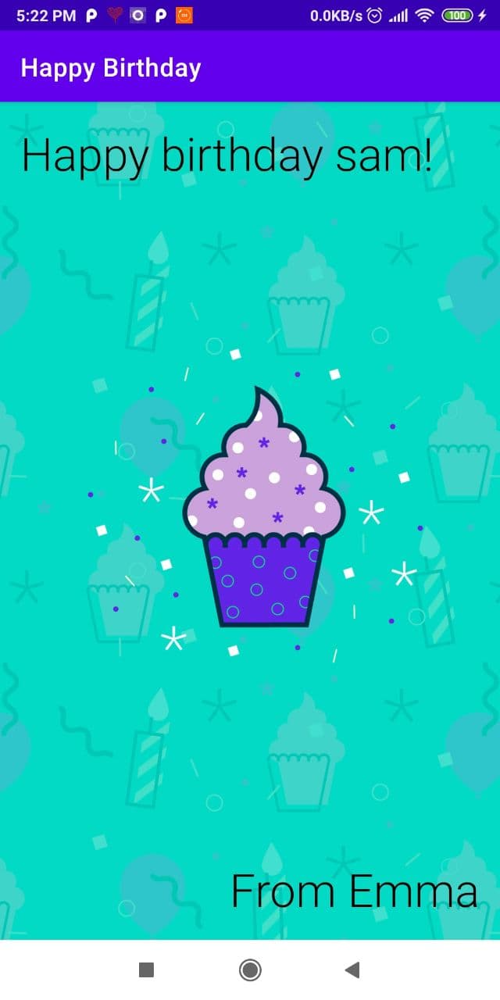

# Happy Birthday App

Unit 1: Kotlin basics (pathway 2 and pathway 3)
- Create your first app
Learn to create Android apps using Android Studio in this introductory pathway.

- Build a basic layout
Learn how to add images and text to your Android apps.

demo

