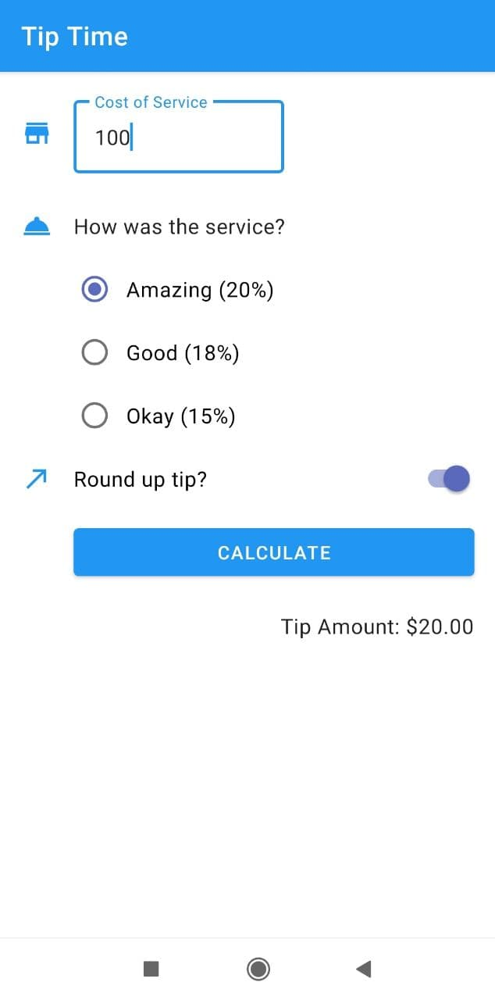

# Google Developer Android Kotlin Course

## What is this repository?

This repository are created for collecting my application from the Google developer course to learn the basics of building Android apps with the Kotlin programming language. [course refer to this link](https://developer.android.com/courses/android-basics-kotlin/course)

documentation:

### Unit 1: Kotlin basics

| [Detail Happy Birthday App](./HappyBirthday/README.md)      | [Detail Dice Roll App](./Dice/README.md) |
| ----------- | ----------- |
|       |        |

### Unit 2: Layout
| [Detail Tip Time App](./TipTime/README.md)      | [Detail Affirmations App](./Affirmations/README.md) |
| ----------- | ----------- |
|  |  | 