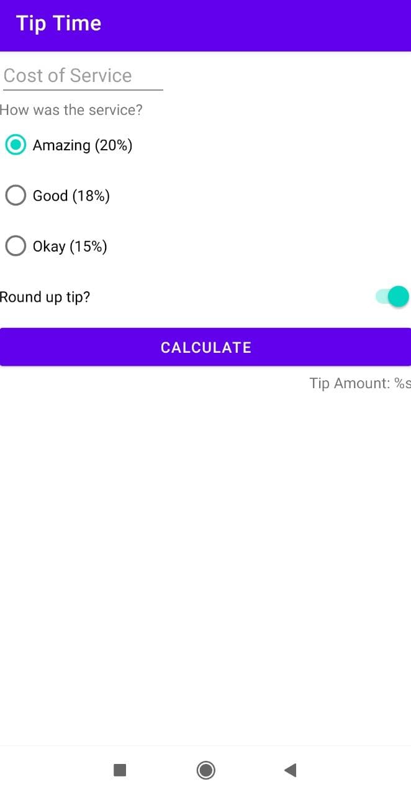
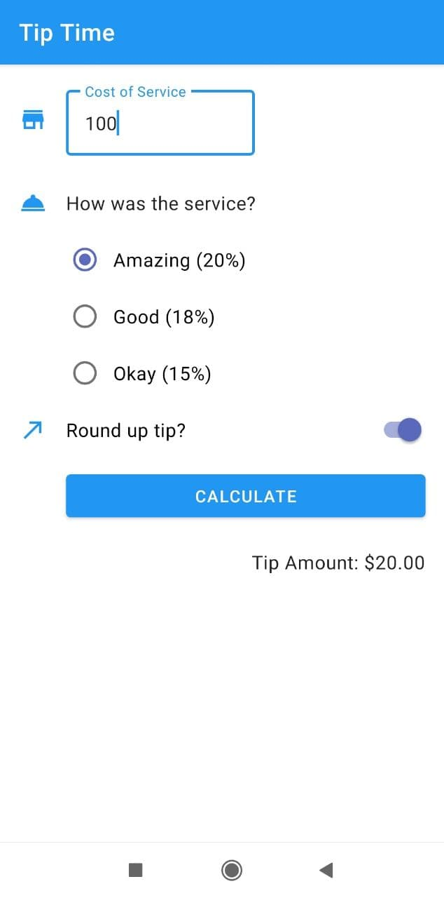

# Happy Birthday App

Unit 2: Layouts (pathway 1)

- Create a tip calculator app by building the layout first and then implementing the logic to calculate the tip from the user input.

demo

Unit 2: Layouts (pathway 2)

- Add visual polish to the Tip Calculator app using Material Design guidelines.

demo

